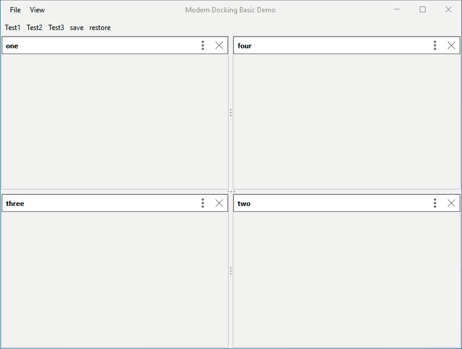
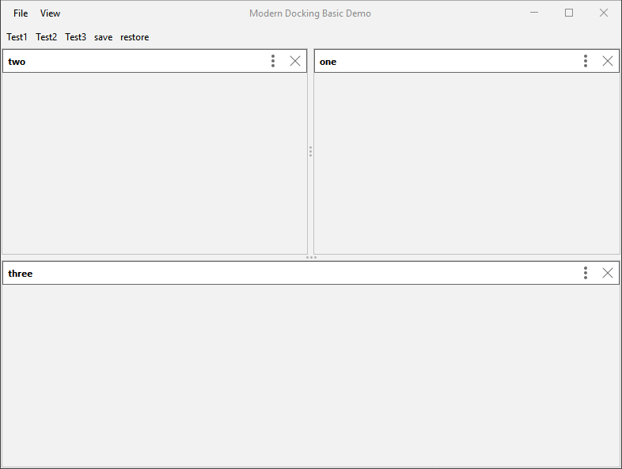
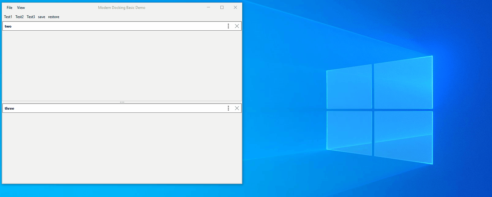
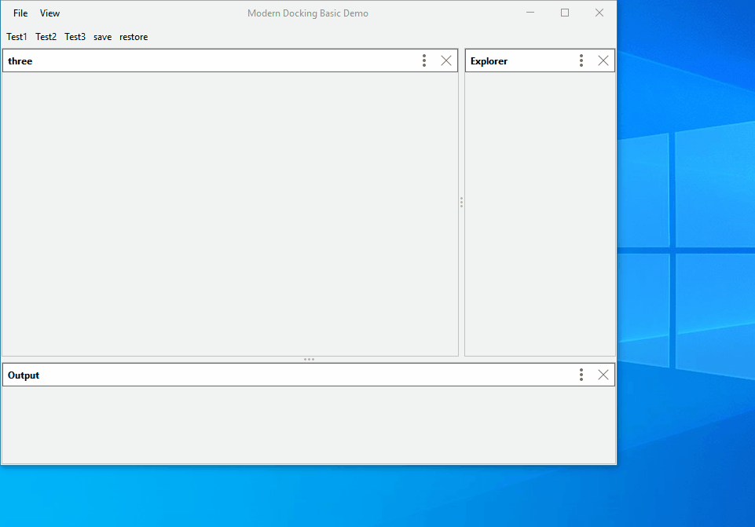
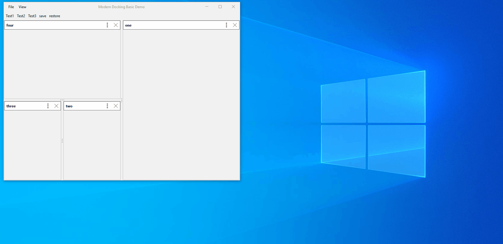
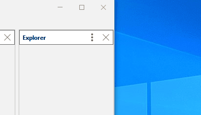

# Modern Docking

This Java library is my take on a docking framework for Java Swing. There are many docking frameworks for Java Swing from back in the day, 
but none of them (that I'm aware of) are maintained and are complicated. Modern Docking was developed to be a far
simpler docking framework to replace the usage of FlexDock. I'm open to suggestions if anyone has ideas to improve the framework.

## Download
Modern Docking binaries are available on <b>Maven Central.</b>

If you use Maven or Gradle, add a dependency with the following coordinates to your build script:

    groupId:     io.github.andrewauclair
    artifactId:  modern-docking-single-app
    version:     (see button below)

Otherwise download `ModernDocking-<version>.jar` here:

For use in apps that have multiple instances in a single JVM, use artifact `modern-docking-multi-app`.

### Snapshots

Modern Docking snapshot binaries are available on
[Sonatype OSSRH](https://s01.oss.sonatype.org/content/repositories/snapshots/io/github/andrewauclair/).
To access the latest snapshot, change the Modern Docking version in your dependencies
to `<version>-SNAPSHOT` (e.g. `0.1.0-SNAPSHOT`) and add the repository
`https://oss.sonatype.org/content/repositories/snapshots/` to your build (see
[Maven](https://maven.apache.org/guides/mini/guide-multiple-repositories.html)
and
[Gradle](https://docs.gradle.org/current/userguide/declaring_repositories.html#sec:declaring_custom_repository)
docs).

## Features
- Docking Component Interface
- Docking Frames (Floating JFrame)
- Docking Ports (One per frame)
- Split Panels
- Tabbed Panels
- Visual Studio style drag floating and docking hints that show drop locations

## Modern Docking UI Extension
- Requires FlatLaf L&F

### Download
Modern Docking UI binaries are available on <b>Maven Central.</b>

If you use Maven or Gradle, add a dependency with the following coordinates to your build script:

    groupId:     io.github.andrewauclair
    artifactId:  modern-docking-ui
    version:     (see button below)

Otherwise download `ModernDockingUI-<version>.jar` here:

## Examples
See basic-demo for a simple example in Example.java and a more complicated example in MainFrame.java.

## Things to show gifs for
- dockable menu item
- min/max

## Using Docking Handles to Dock
When dragging a dockable hovering over another dockable will display docking handles in the center of the dockable. 
These handles provide easy access to dock to the North, South, East and West regions.

The dockable can also be docked to any of these regions by hovering over the region itself and dropping the dockable.

The root also has North, South, East and West handles to dock the dockable directly to the root of the panel.

## Adjusting Split
Splits can be adjusted and perform continuous layout. Double clicking the split will return it to 50-50 split for the 2 sides.

## Creating Tab Group
Panels can be grouped into tabbed panes by dragging a dockable to the center region of another dockable.

## Closing Panels
Panels can be closed using the X button on their headers. This option can be disabled in the source code.

## Floating a Panel
Panels can be floated as their own window by dragging them by their header and dropping them outside the frame.
This creates a new JFrame with the dockable in it. More dockables can then be docked to this dockable.

## Pinning a Panel
Panels can be set to unpinned with View Mode > Unpinned from the settings button on the panel header. 
This option will display the panel on a side toolbar as a button which can be pressed to display the panel.
Clicking outside the panel will return it to the toolbar. To pin the panel and return it to normal, select the View Mode > Pinned option. 

## Option Panel in New Window
Panels can be opened in their own window using View Mode > Window.

## Additional Settings Options
Display custom settings options on the settings menu.

[//]: # "-- TODO add some links to blog posts that I will eventually write"
[//]: # "-- TODO come up with what needs to be done for 1.0, might just be more integration at work and then it's done"
